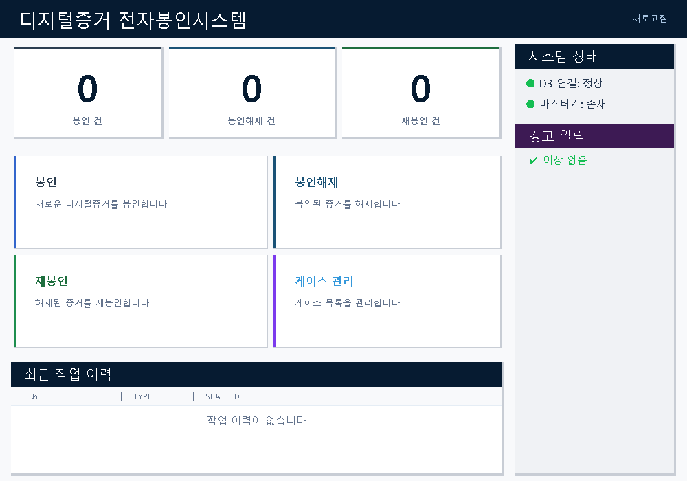
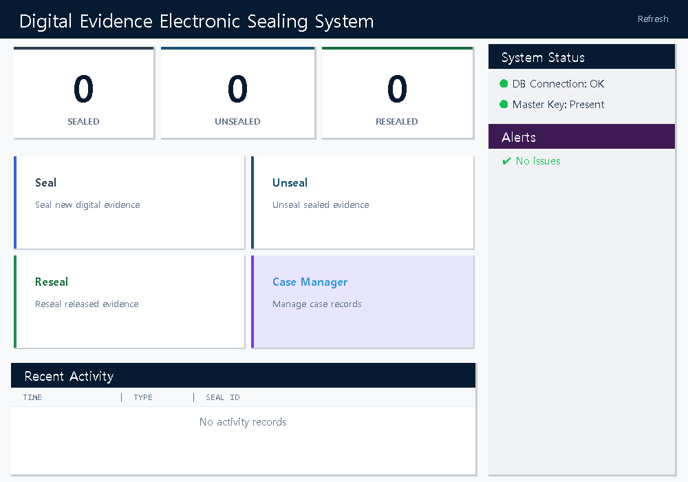
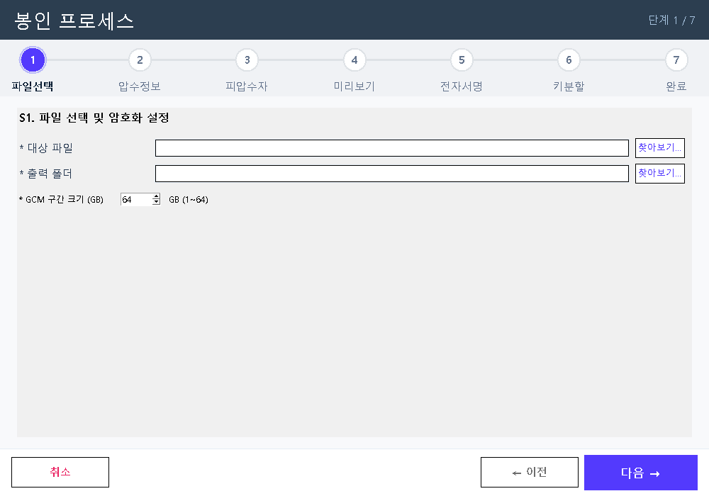
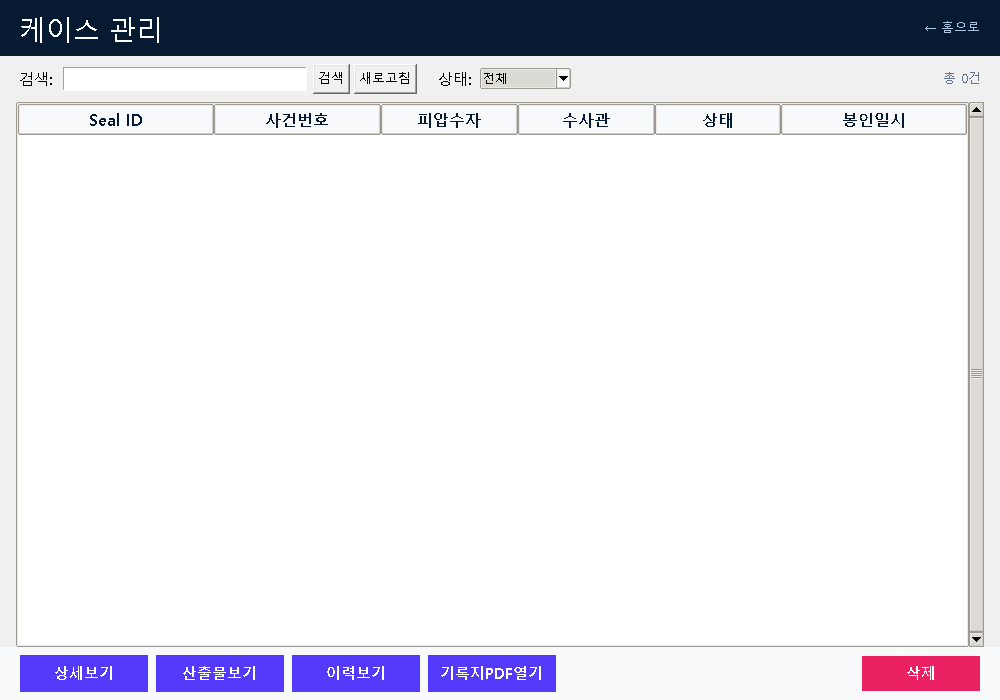

# Enc_Envelope - Digital Evidence Electronic Sealing System

**형사절차에서 디지털증거 봉인 모델 설계** 논문 구현체

> 디지털증거 압수/수색 시 피압수자의 참여권 보장과 증거 무결성을 위한 암호화 기반 전자봉인시스템

Based on: *"Design of Digital Evidence Sealing Model for Criminal Proceedings"* (Park Hee-won, Sungkyunkwan University, 2025)

---

## Screenshots

### Dashboard (Korean)


### Dashboard (English)


### Seal Wizard


### Case Manager


---

## Features

### Sealing (봉인)
- AES-256-GCM encryption with 64GB chunk segmentation
- Shamir's Secret Sharing (2-of-4) key splitting across investigator, subject, system, admin
- Seal record generation (JSON + PDF) with PAdES digital signature
- RFC 3161 TSA timestamps for time verification
- Encryption pause/resume support

### Unsealing (봉인해제)
- Key share recovery (any 2 of 4) and AES decryption
- SHA-256/MD5 hash integrity verification
- Unseal record generation

### Resealing (재봉인)
- Unknown file classification and derived file tracking
- Re-encryption with new key and fresh key split
- Reseal record generation

### Web Remote Participation
- Role-based access: investigator, subject, admin
- OTP authentication (email-based)
- Authentication chain pattern (basic info + password/OTP/certificate)
- Desktop-web synchronization via sync API
- CSRF protection

### Desktop GUI
- Stripe-inspired design system with deep navy headers and purple accents
- Full dashboard with statistics, system status, alerts, recent activity
- 7-step seal wizard / 5-step unseal wizard / 8-step reseal wizard
- Step indicator with click navigation and readonly review of completed steps
- Case management: create, search, filter, detail view, artifacts, history timeline
- Enhanced signature pad (4:3 ratio, pressure simulation, confirmation dialog)
- Date picker calendar widget
- Toast notifications
- Korean/English language toggle (i18n with 450+ translation keys)
- Progress bar with elapsed/remaining time for long operations

---

## Tech Stack

| Area | Technology |
|------|-----------|
| Language | Python 3.12+ |
| Desktop GUI | Tkinter + ttk (clam theme) |
| Encryption | cryptography (AES-256-GCM) |
| Key Splitting | secretsharing (Shamir's Secret Sharing) |
| Digital Signature | pyHanko (PAdES) |
| PDF Rendering | ReportLab (Platypus) + Jinja2 |
| Web Framework | Flask |
| Local DB | SQLite (WAL mode) |
| Web DB | MariaDB (SQLite fallback) |
| Testing | pytest + pytest-cov |

---

## Project Structure

```
Enc_Envelope/
├── src/
│   ├── desktop/
│   │   ├── main.py                # Entry point
│   │   ├── gui/                   # GUI modules (15 files)
│   │   │   ├── app.py             # Main application window
│   │   │   ├── dashboard.py       # Home dashboard
│   │   │   ├── seal_wizard.py     # 7-step sealing wizard
│   │   │   ├── unseal_wizard.py   # 5-step unsealing wizard
│   │   │   ├── reseal_wizard.py   # 8-step resealing wizard
│   │   │   ├── case_manager.py    # Case management
│   │   │   ├── signature_pad.py   # Enhanced signature pad
│   │   │   ├── step_indicator.py  # Step progress indicator
│   │   │   ├── theme.py           # Design system (Stripe-inspired)
│   │   │   ├── i18n.py            # Internationalization (KO/EN)
│   │   │   └── widgets.py         # Reusable widgets (DateEntry, etc.)
│   │   ├── crypto/                # Encryption modules (10 files)
│   │   │   ├── aes_gcm_encrypt.py # AES-256-GCM encryption
│   │   │   ├── aes_gcm_decrypt.py # AES-256-GCM decryption
│   │   │   ├── sss_split.py       # SSS key splitting
│   │   │   ├── sss_recover.py     # SSS key recovery
│   │   │   ├── local_kms.py       # Local KMS (envelope encryption)
│   │   │   └── time_access_control.py  # Time-based access control
│   │   ├── signature/             # Digital signature modules (7 files)
│   │   │   ├── cert_generator.py  # X.509 certificate generation
│   │   │   ├── pdf_signer.py      # PAdES PDF signing
│   │   │   ├── tsa_client.py      # TSA client
│   │   │   └── tsa_server.py      # Internal TSA server (RFC 3161)
│   │   ├── record/                # Record generation modules (9 files)
│   │   │   ├── record_builder.py  # Seal/unseal/reseal record builder
│   │   │   ├── pdf_renderer.py    # PDF rendering (ReportLab)
│   │   │   └── templates/         # Jinja2 HTML templates
│   │   └── db/
│   │       └── sqlite_store.py    # SQLite storage
│   └── web/                       # Flask web system (13 files)
│       ├── app.py                 # Flask app factory
│       ├── auth/                  # Authentication (OTP, chain)
│       ├── models/                # Database models
│       ├── routes/                # API routes (investigator, suspect, admin, sync)
│       └── templates/             # Web UI templates
├── tests/
│   ├── unit/                      # 19 unit test files
│   ├── integration/               # 3 integration test files
│   ├── e2e_auto_test.py           # E2E automated test
│   └── e2e_logic_verify.py        # E2E logic verification
├── DESIGN.md                      # UI design system specification
├── requirements.txt
└── pyproject.toml
```

---

## Installation

### Prerequisites
- Python 3.12 or higher
- Windows 10/11 (primary), macOS/Linux (partial support)

### Setup

```bash
# Clone the repository
git clone https://github.com/smshin1121/Enc_Envelope.git
cd Enc_Envelope

# Install dependencies
pip install -r requirements.txt
```

---

## Usage

### Desktop Application

```bash
python src/desktop/main.py
```

On first launch, the system automatically:
1. Creates app data directory: `~/.enc_envelope/`
2. Initializes SQLite database: `~/.enc_envelope/seal_system.db`
3. Generates master key: `~/.enc_envelope/master.key`

### Workflow A: Independent Sealing

1. Dashboard > Click **"Seal"** card
2. S1: Select target file and output directory
3. S2: Enter case information (case number, investigator)
4. S3: Enter subject information + draw signature
5. S4: Preview seal record
6. S5: Digital signature processing (automatic)
7. S6: Key split results + set access restriction period
8. S7: Completion summary
9. Case automatically saved to database

### Workflow B: Case-first Sealing

1. Case Manager > Click **"+ New Case"**
2. Enter case number, investigator, subject name
3. Select created case > Click **"Start Seal"**
4. S2 fields auto-populated from case data
5. Complete sealing wizard as above

### Language Toggle

Menu bar > **Language** > Select **English** or **한국어**

### Web System

```bash
# Development mode
flask --app src/web/app:create_app run --debug
```

---

## Testing

```bash
# Run all tests (260 tests)
pytest

# With coverage report
pytest --cov=src --cov-report=term-missing

# Unit tests only
pytest tests/unit/

# Integration tests only
pytest tests/integration/

# E2E automated test
python tests/e2e_auto_test.py

# E2E logic verification (78 checks)
python tests/e2e_logic_verify.py
```

---

## Design System

The UI follows a Stripe-inspired design system adapted for forensic/governmental use:

- **Primary**: Purple `#533afd` for CTAs and interactive elements
- **Headings**: Deep Navy `#061b31` for authority
- **Process Colors**: Seal Blue `#2c3e50` / Unseal Navy `#1a5276` / Reseal Green `#1e6e3e`
- **Typography**: Light weight (300) headings, 500 for interactive, 400 for body
- **Shadows**: Blue-tinted chromatic depth (`rgba(50,50,93,0.12)`)

See [DESIGN.md](DESIGN.md) for the complete specification.

---

## Architecture

```
[Desktop GUI (Tkinter)]
    ├── Seal Wizard ──→ AES-256-GCM Encrypt ──→ SSS Key Split
    ├── Unseal Wizard ──→ SSS Key Recover ──→ AES Decrypt + Hash Verify
    ├── Reseal Wizard ──→ Classify Files ──→ Re-encrypt + New Key Split
    ├── Case Manager ──→ SQLite CRUD
    └── Dashboard ──→ Statistics + Alerts

[Web System (Flask)]
    ├── Investigator ──→ Register Case / Upload Key Share / Recover Key
    ├── Subject ──→ Authenticate / View Records / Upload Key Share
    └── Admin ──→ Manage Shares / Emergency Recovery

[Shared Infrastructure]
    ├── Local KMS (Master Key + Envelope Encryption)
    ├── TSA Server (RFC 3161)
    ├── X.509 Certificate Generator
    └── PAdES PDF Signer (pyHanko)
```

---

## References

- Park, H. (2025). *Design of Digital Evidence Sealing Model for Criminal Proceedings*. Master's Thesis, Sungkyunkwan University.
- NIST SP 800-38D: Recommendation for Block Cipher Modes of Operation: GCM
- RFC 3161: Internet X.509 Public Key Infrastructure Time-Stamp Protocol
- Shamir, A. (1979). How to Share a Secret. *Communications of the ACM*.

---

## License

This project is developed for academic research purposes.
